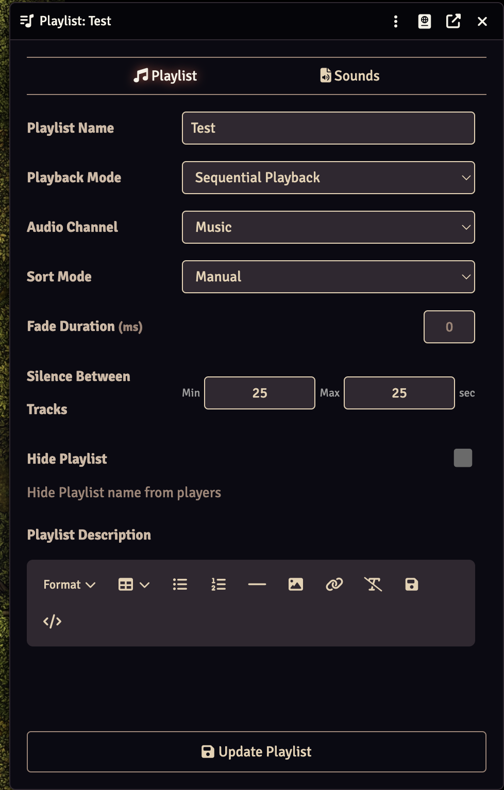

# Dorman Lakely's Playlist Enhancements

Add natural silence between tracks in your FoundryVTT playlists for a more immersive audio experience.



## What Does This Module Do?

When playing a playlist in Sequential or Shuffle mode, FoundryVTT immediately starts the next track as soon as the current one ends. This module lets you configure a silence gap between tracks, with a randomized duration for a more natural feel.

## Key Features

- **Configurable silence range** - Set a minimum and maximum silence duration (in seconds) between tracks
- **Per-playlist settings** - Each playlist can have its own silence configuration
- **Randomized gaps** - Silence duration is randomized within your range for natural transitions
- **Works with Sequential and Shuffle modes** - Automatically skipped for Simultaneous playback
- **Compatible with Monk's Sound Enhancements** - Works alongside other playlist modules

## Requirements

- FoundryVTT v13 or higher

## Installation

1. Open Foundry VTT
2. Go to **Add-on Modules** tab
3. Click **Install Module**
4. Search for "Dorman Lakely's Playlist Enhancements" or paste:
   ```
   https://raw.githubusercontent.com/jesshmusic/dorman-lakelys-playlist-enhancements/main/module.json
   ```
5. Click **Install**
6. Enable the module in your game world

## Usage

1. Open any playlist's configuration (click the edit icon)
2. Below the **Fade Duration** field, you'll see **Silence Between Tracks** with Min and Max inputs
3. Set your desired range in seconds (e.g., Min: 2, Max: 5)
4. Click **Update Playlist**

When the playlist plays, each track transition will pause for a random duration within your configured range before starting the next track.

Setting both values to 0 (the default) disables the feature and uses normal Foundry behavior.

## Support

- **Issues & Bugs**: [GitHub Issues](https://github.com/jesshmusic/dorman-lakelys-playlist-enhancements/issues)
- **Support Development**: [Patreon](https://patreon.com/dormanlakely)

## License

MIT License - free to use and modify!
